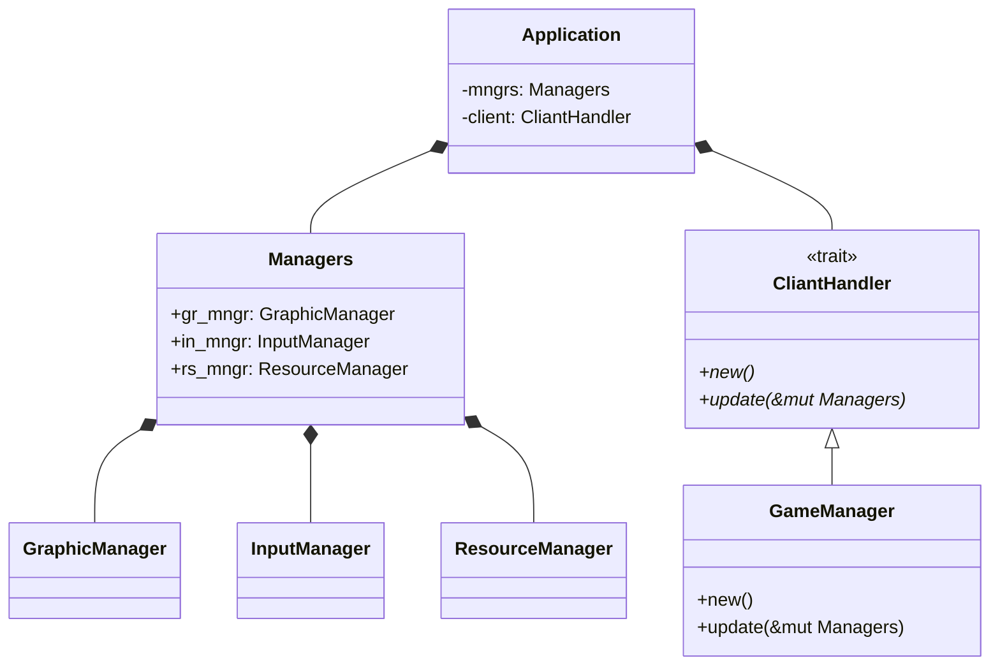

# Architecture

## General

Rustで記述する。

画面描画・楽曲再生・IO管理を司るエンジン部と・そのエンジンを叩いてゲームを駆動するクライアント部に二分される。
各部の詳細は各部のドキュメントを参照せよ。

## Core Objects

主要オブジェクトをクラス図に書き起こすと次のようになる：

ただし、上図は関係性を表しただけに過ぎず、ソースコードを厳密に反映しているものではない。

`Application`は`CliantHandler`をトレイト境界に持つ総称型のメンバを持ち、`Application`によって生成・更新される。
更新する際は`CliantHandler`を介して`GameManager`へ`Managers`が渡る。
`GameManager`すなわちクライアントはエンジンから渡った`Managers`すなわちエンジンの機能群から適切に機能を呼び出すことでゲームを駆動する。
